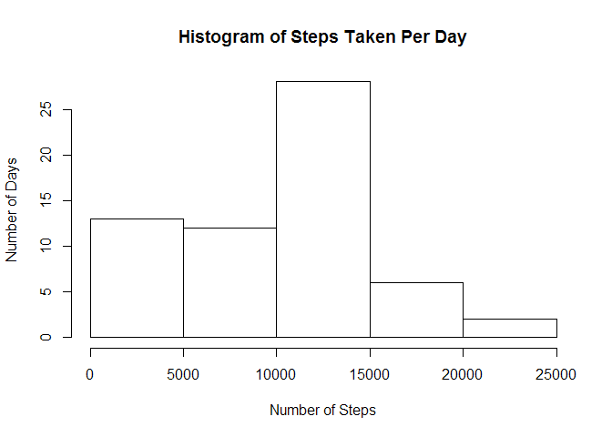
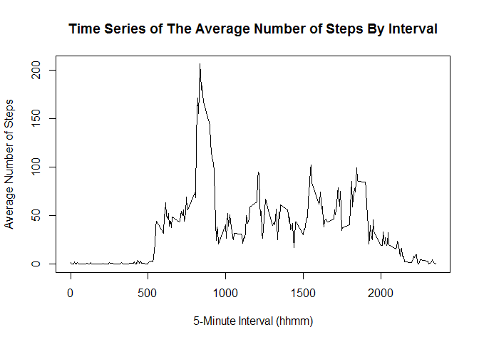
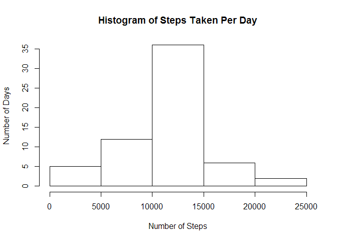
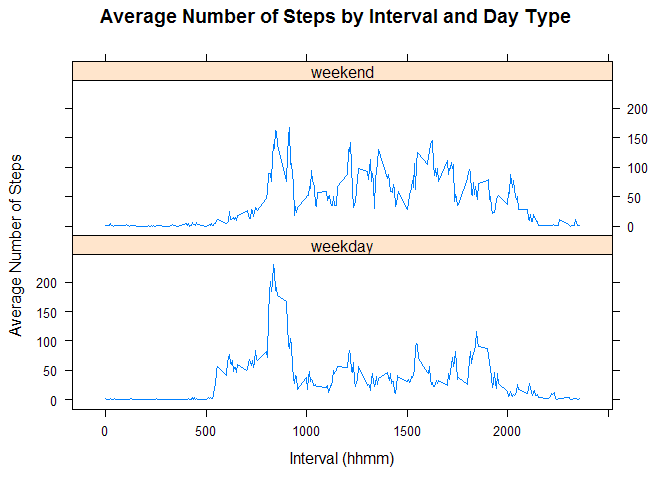

# Reproducible Research: Peer Assessment 1


## Loading and preprocessing the data

Load the data and view the summary of the data:

```r
data <- read.csv(paste(getwd(),"/activity.csv", sep=""), stringsAsFactors=FALSE)
summary(data)
```

```
##      steps            date              interval     
##  Min.   :  0.00   Length:17568       Min.   :   0.0  
##  1st Qu.:  0.00   Class :character   1st Qu.: 588.8  
##  Median :  0.00   Mode  :character   Median :1177.5  
##  Mean   : 37.38                      Mean   :1177.5  
##  3rd Qu.: 12.00                      3rd Qu.:1766.2  
##  Max.   :806.00                      Max.   :2355.0  
##  NA's   :2304
```

```r
str(data)
```

```
## 'data.frame':	17568 obs. of  3 variables:
##  $ steps   : int  NA NA NA NA NA NA NA NA NA NA ...
##  $ date    : chr  "2012-10-01" "2012-10-01" "2012-10-01" "2012-10-01" ...
##  $ interval: int  0 5 10 15 20 25 30 35 40 45 ...
```

Use lubridate to convert date variable from class 'chr' to class 'POSIXct':

```r
library(lubridate)
data$date <- ymd(data$date)
class(data$date)
```

```
## [1] "POSIXct" "POSIXt"
```

## What is mean total number of steps taken per day?

Calculate the number of steps per day:

```r
library(dplyr)
```

```
## 
## Attaching package: 'dplyr'
```

```
## The following objects are masked from 'package:lubridate':
## 
##     intersect, setdiff, union
```

```
## The following objects are masked from 'package:stats':
## 
##     filter, lag
```

```
## The following objects are masked from 'package:base':
## 
##     intersect, setdiff, setequal, union
```

```r
byday <- data %>% group_by(date) %>% summarize(total=sum(steps, na.rm=TRUE))
```

Calculate the mean number of steps per day:

```r
mean <- mean(byday$total)
mean
```

```
## [1] 9354.23
```

Plot a histogram of the total number of steps per day using base plotting:

```r
hist(byday$total, main = "Histogram of Steps Taken Per Day", xlab = "Number of Steps", ylab = "Number of Days")
```



Calculate the mean and median daily number of steps:

```r
dailymean <- mean(byday$total)
dailymedian <- median(byday$total)
paste("Mean daily number of steps is",round(dailymean))
```

```
## [1] "Mean daily number of steps is 9354"
```

```r
paste("Median daily number of steps is",round(dailymedian))
```

```
## [1] "Median daily number of steps is 10395"
```

## What is the average daily activity pattern?

Calculate the average number of steps per interval across all days:

```r
byinterval <- data %>% group_by(interval) %>% summarize(mean=mean(steps, na.rm=TRUE))
```

Plot the time series of the average number of steps per interval:

```r
plot(byinterval$interval, byinterval$mean, type="l", main = "Time Series of The Average Number of Steps By Interval", xlab = "5-Minute Interval (hhmm)", ylab = "Average Number of Steps")
```



Calculate which interval contains the maximum average number of steps:

```r
Maxinterval <- byinterval[which(byinterval$mean == max(byinterval$mean)),1]
paste("The interval which contains the maximum average number of steps is", Maxinterval)
```

```
## [1] "The interval which contains the maximum average number of steps is 835"
```

## Imputing missing values

Calculate total number of rows with 'NA':

```r
paste("Total number of rows with 'NA' is", length(data$steps[is.na(data$steps)]))
```

```
## [1] "Total number of rows with 'NA' is 2304"
```

Fill in the missing values in the steps variable, using the mean for that 5-minute interval:
Step 1. Divide the data into those with 'NA' and those without:

```r
data$id <- 1:nrow(data)
data1 <- filter(data, is.na(steps))
dim(data1)
```

```
## [1] 2304    4
```

```r
data2 <- filter(data, !is.na(steps))
dim(data2)
```

```
## [1] 15264     4
```

```r
dim(data1) + dim(data2)
```

```
## [1] 17568     8
```

Step 2. Using the 'byinterval' data, fill in the steps variable that are 'NA' with the the mean steps for that interval:

```r
m <- merge(byinterval, data1, by="interval")
m <- mutate(m, steps = mean) %>% select(-2)
```

Step 3. Combine the split data back into one set:

```r
datafilled <- rbind(data2, m)
sum(is.na(datafilled))
```

```
## [1] 0
```

```r
datafilled <- arrange(datafilled, id) %>% select(-4)
```

Make a histogram of the average number of steps per day, calculate the mean and median, and compare to earlier unfilled data:

```r
bydayfilled <- datafilled %>% group_by(date) %>% summarize(total=sum(steps))
hist(bydayfilled$total, main = "Histogram of Steps Taken Per Day", xlab = "Number of Steps", ylab = "Number of Days")
```



```r
dailymeanfilled <- mean(bydayfilled$total)
dailymedianfilled <- median(bydayfilled$total)
paste("Mean daily number of steps is",round(dailymeanfilled))
```

```
## [1] "Mean daily number of steps is 10766"
```

```r
paste("Median daily number of steps is",round(dailymedianfilled))
```

```
## [1] "Median daily number of steps is 10766"
```

```r
diffmean <- dailymeanfilled - dailymean
diffmedian <- dailymedianfilled - dailymedian
paste("Difference in mean between filled and unfilled data is", round(diffmean))
```

```
## [1] "Difference in mean between filled and unfilled data is 1412"
```

```r
paste("Difference in median between filled and unfilled data is", round(diffmedian))
```

```
## [1] "Difference in median between filled and unfilled data is 371"
```

## Are there differences in activity patterns between weekdays and weekends?

Create factor and factor labels, "weekday" and "weekend":

```r
whatday <- wday(datafilled$date)
daytype <- c(whatday == 1 | whatday == 7)
datafilled$daytype <- factor(daytype, labels=c("weekday", "weekend"))
```

Average across days:

```r
library(lattice)
byinterval1 <- datafilled %>% group_by(interval, daytype) %>% summarize(mean=mean(steps, na.rm=TRUE))
xyplot(mean~interval | daytype, data=byinterval1, layout = c(1,2), type = "l", main = "Average Number of Steps by Interval and Day Type", xlab = "Interval (hhmm)", ylab = "Average Number of Steps")
```


